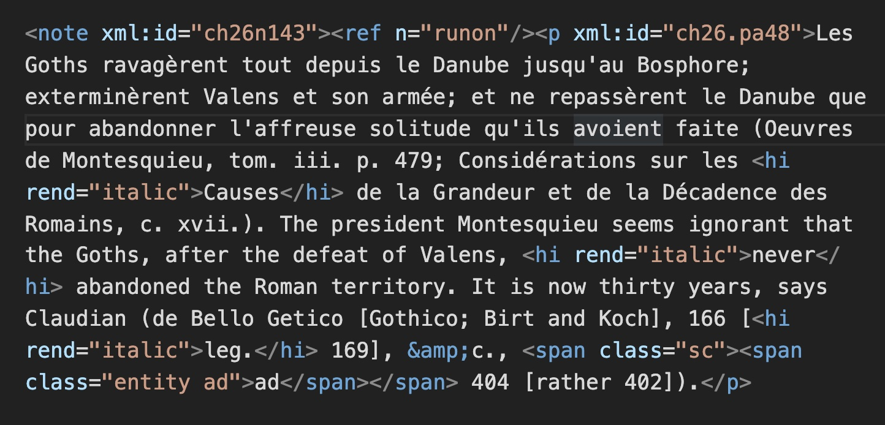
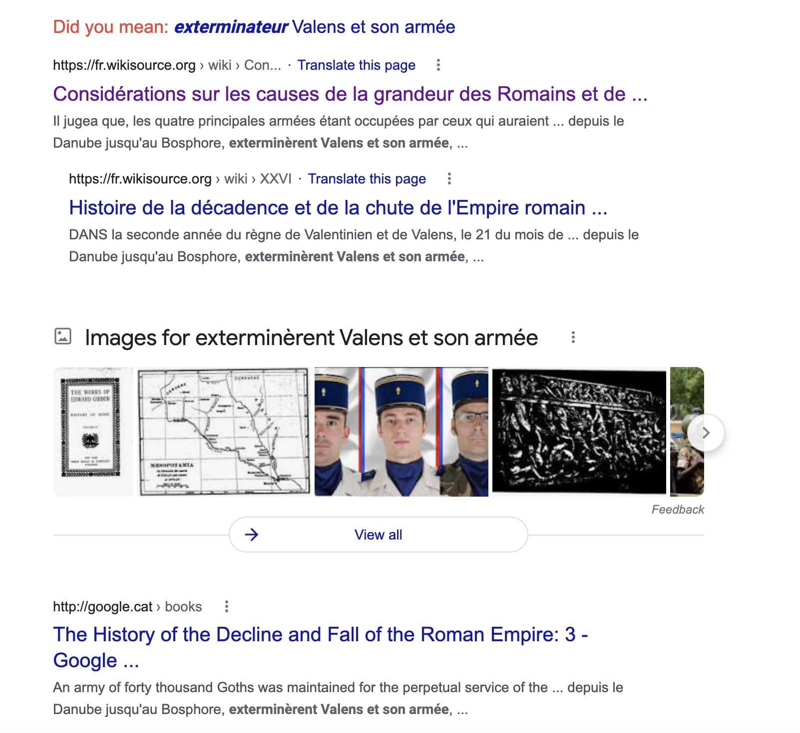
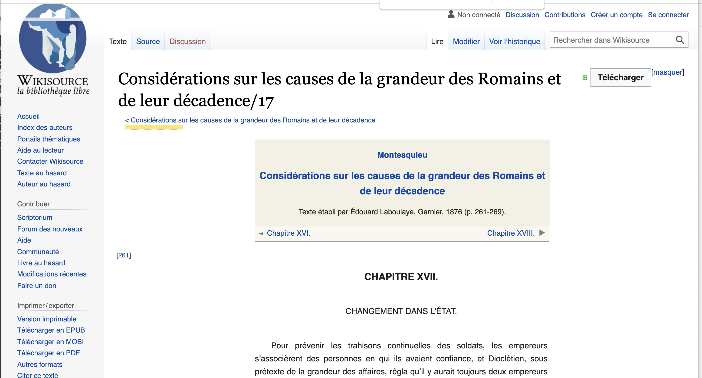
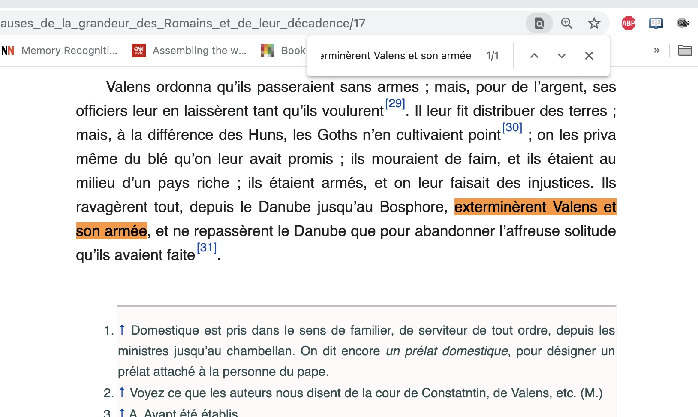
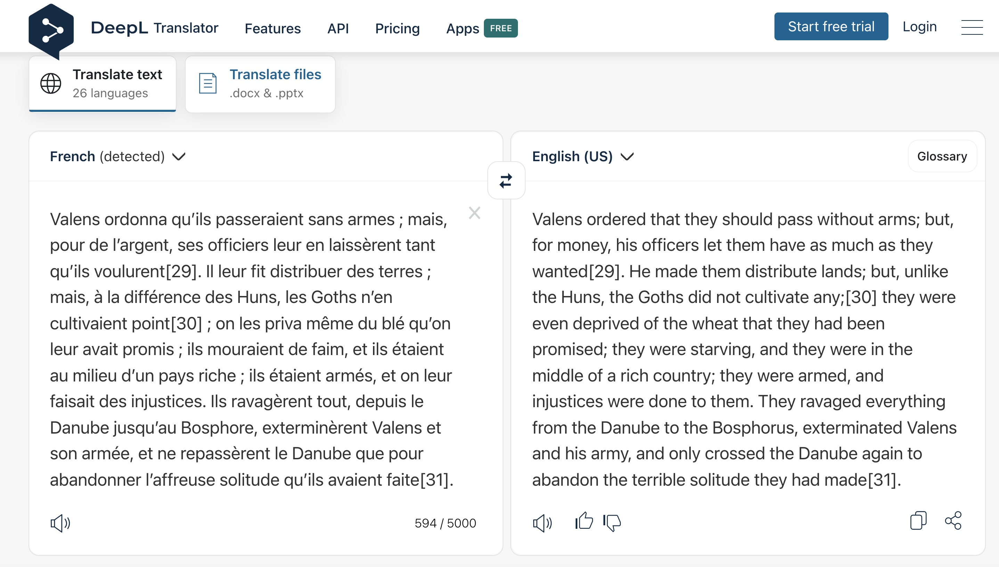

# Notes on text reuse detection in Gibbon

## What can we do just by randomly using Google to see if we can find searches?

https://www.google.com/search?q=extermin%C3%A8rent+Valens+et+son+arm%C3%A9e&oq=extermin%C3%A8rent+Valens+et+son+arm%C3%A9e

The source text has been entered by Wikisource -- a far better curated text than we will usually find when we look at Gibbon's sources but a happy find: https://fr.wikisource.org/wiki/Consid%C3%A9rations_sur_les_causes_de_la_grandeur_des_Romains_et_de_leur_d%C3%A9cadence/17 

Then we can find this precise passage in Montesquieu by searching in the web browser for our original search string:

We then generate an English version:

https://www.deepl.com/translator#fr/en/Valens%20ordonna%20qu%E2%80%99ils%20passeraient%20sans%20armes%20%3B%20mais%2C%20pour%20de%20l%E2%80%99argent%2C%20ses%20officiers%20leur%20en%20laiss%C3%A8rent%20tant%20qu%E2%80%99ils%20voulurent%5B29%5D.%20Il%20leur%20fit%20distribuer%20des%20terres%20%3B%20mais%2C%20%C3%A0%20la%20diff%C3%A9rence%20des%20Huns%2C%20les%20Goths%20n%E2%80%99en%20cultivaient%20point%5B30%5D%20%3B%20on%20les%20priva%20m%C3%AAme%20du%20bl%C3%A9%20qu%E2%80%99on%20leur%20avait%20promis%20%3B%20ils%20mouraient%20de%20faim%2C%20et%20ils%20%C3%A9taient%20au%20milieu%20d%E2%80%99un%20pays%20riche%20%3B%20ils%20%C3%A9taient%20arm%C3%A9s%2C%20et%20on%20leur%20faisait%20des%20injustices.%20Ils%20ravag%C3%A8rent%20tout%2C%20depuis%20le%20Danube%20jusqu%E2%80%99au%20Bosphore%2C%20extermin%C3%A8rent%20Valens%20et%20son%20arm%C3%A9e%2C%20et%20ne%20repass%C3%A8rent%20le%20Danube%20que%20pour%20abandonner%20l%E2%80%99affreuse%20solitude%20qu%E2%80%99ils%20avaient%20faite%5B31%5D.

